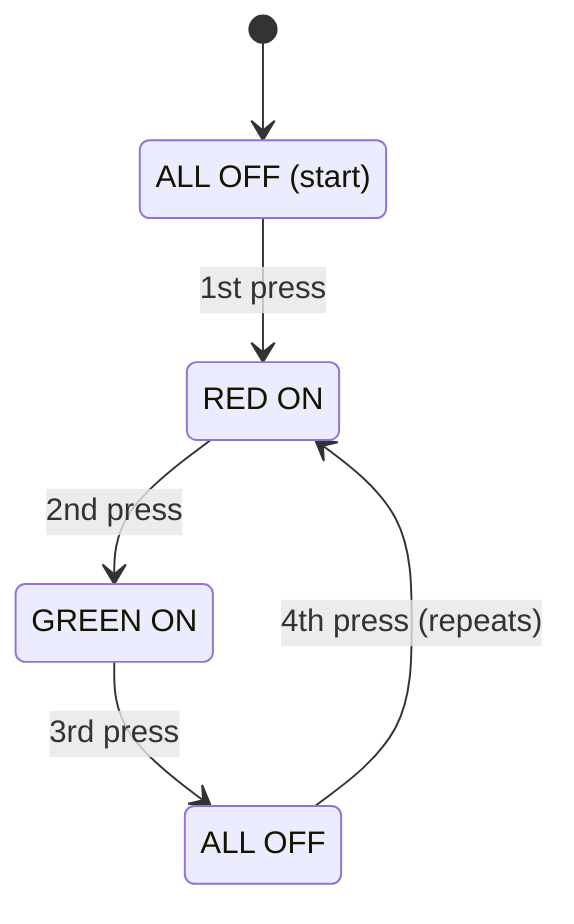
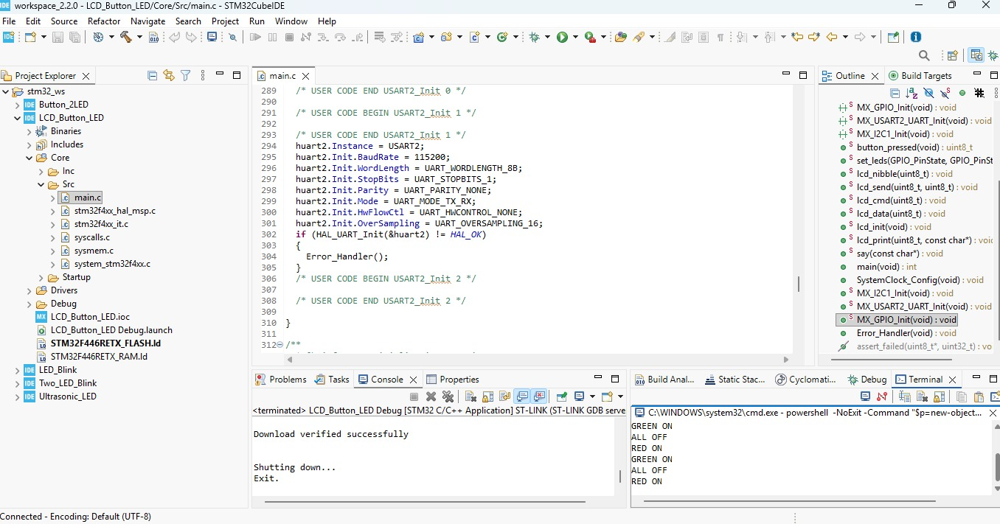
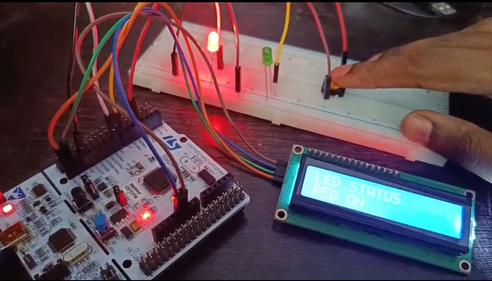
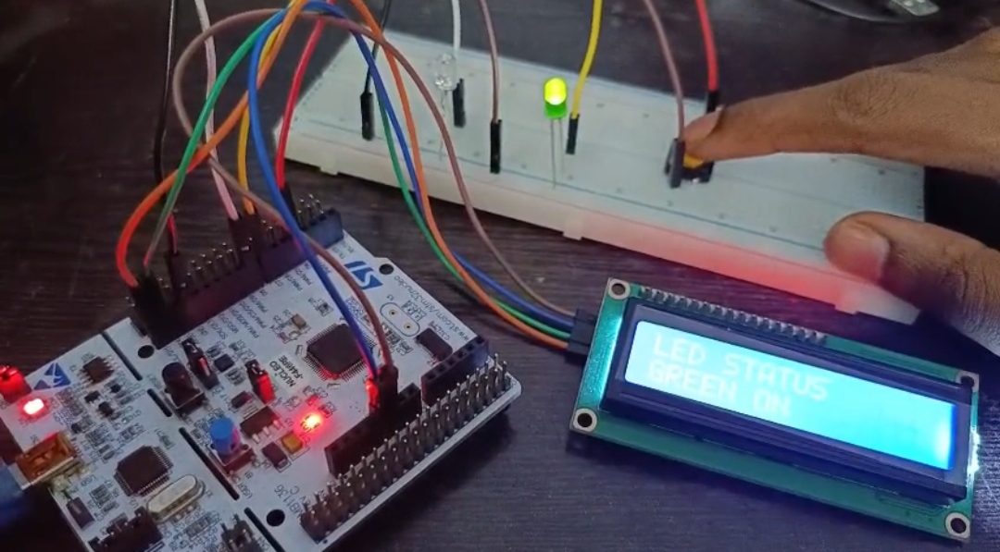
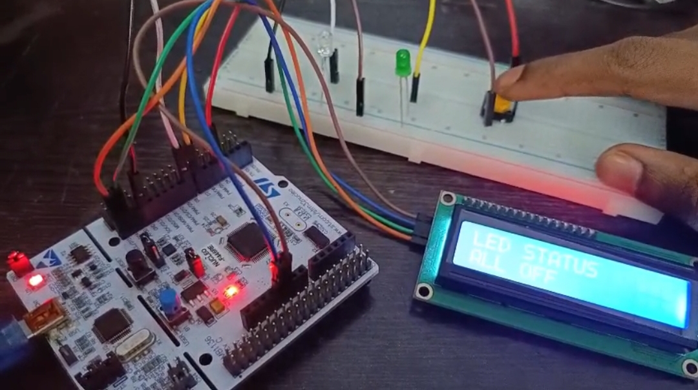

# STM32 NUCLEO-F446RE LCD with Button and Two LEDs

## Project Overview

This project controls a **red LED and a green LED** with a **single push button** on the **STM32 NUCLEO-F446RE** board and shows the current LED status on a **16×2 I2C LCD**.

Each press of the button moves to the next state, and the sequence repeats forever:

| Button press | Red LED (D8) | Green LED (D7) | LCD line 2 | UART message |
| ------------ | ------------ | -------------- | ---------- | ------------ |
| Start | ⚫ OFF | ⚫ OFF | ALL OFF | none |
| 1st press | 🔴 ON | ⚫ OFF | RED ON | RED ON |
| 2nd press | ⚫ OFF | 🟢 ON | GREEN ON | GREEN ON |
| 3rd press | ⚫ OFF | ⚫ OFF | ALL OFF | ALL OFF |
| 4th press | back to the 1st state | | | |

Line 1 of the LCD always shows **LED STATUS**. The button uses the microcontroller's **internal pull-up**, so it needs no external resistor. The state is also sent over **UART2** to a PowerShell terminal inside STM32CubeIDE.

The project was created with **STM32CubeMX** and built, flashed and run with **STM32CubeIDE 2.2.0**.

## Key Features

- STM32 NUCLEO-F446RE board
- 16×2 character LCD with an I2C backpack (PCF8574)
- I2C1 communication using the HAL library
- One push button with the internal pull-up (GPIO input)
- Two external LEDs (red and green) as GPIO outputs
- Software debouncing
- UART2 status messages through the on-board ST-LINK virtual COM port
- Programming and debugging through the on-board ST-LINK

## Hardware Required

| Component | Quantity |
| --------- | -------- |
| STM32 NUCLEO-F446RE board | 1 |
| 16×2 LCD with I2C backpack (4 pins: GND, VCC, SDA, SCL) | 1 |
| Push button | 1 |
| Green LED | 1 |
| Red LED | 1 |
| Breadboard | 1 |
| Jumper wires | As required |
| USB cable (data cable) | 1 |

## Pin Configuration

| Signal | MCU Pin | Arduino Pin | Mode |
| ------ | ------- | ----------- | ---- |
| BUTTON | PB5 | D4 | GPIO_Input (Pull-up) |
| GREEN_LED | PA8 | D7 | GPIO_Output |
| RED_LED | PA9 | D8 | GPIO_Output |
| I2C1_SCL | PB8 | D15 | I2C1 |
| I2C1_SDA | PB9 | D14 | I2C1 |
| USART2_TX | PA2 | (ST-LINK virtual COM port) | Alternate function |
| USART2_RX | PA3 | (ST-LINK virtual COM port) | Alternate function |

## Wiring

| Component | Connection |
| --------- | ---------- |
| LCD GND | GND |
| LCD VCC | 5V |
| LCD SDA | D14 (PB9) |
| LCD SCL | D15 (PB8) |
| Push button, leg 1 | D4 (PB5) |
| Push button, leg 2 | GND |
| Green LED long leg (+) | D7 (PA8) |
| Red LED long leg (+) | D8 (PA9) |
| Both LED short legs (-) | GND |

For a 4-leg push button, use two legs on opposite corners (diagonal), because legs on the same side are connected internally.

## Circuit Diagram

```
 NUCLEO-F446RE
┌───────────────┐
│ D15 (PB8) ────┼──── SCL ┐
│ D14 (PB9) ────┼──── SDA ├── 16x2 I2C LCD
│ 5V ───────────┼──── VCC │
│ GND ──────────┼──── GND ┘
│               │
│ D4 (PB5) ─────┼──── Push button ──── GND
│               │
│ D7 (PA8) ─────┼────► Green LED (+) ┐
│ D8 (PA9) ─────┼────► Red LED (+)   │
│ GND ──────────┼──── both LED (-) ◄─┘
└───────────────┘
```

## STM32CubeMX Configuration

1. Create a new project and select the **NUCLEO-F446RE** board in the Board Selector.
2. Initialize all peripherals with their default mode. This enables **USART2** on PA2 and PA3 for the ST-LINK virtual COM port.
3. Set **PB5** to `GPIO_Input` with the label `BUTTON`. In **System Core → GPIO → PB5**, set **GPIO Pull-up/Pull-down** to **Pull-up**.
4. Set **PA8** to `GPIO_Output` with the label `GREEN_LED`.
5. Set **PA9** to `GPIO_Output` with the label `RED_LED`.
6. Click **PB8** and choose `I2C1_SCL`, then click **PB9** and choose `I2C1_SDA`. Open **Connectivity → I2C1**, set the mode to **I2C**, and keep the speed at **100000 Hz** (Standard Mode).
7. Open **Connectivity → USART2** and check the mode is **Asynchronous** with a baud rate of **115200**, 8 data bits, no parity, 1 stop bit.
8. In the Project Manager, set the toolchain to **STM32CubeIDE**, then click **Generate Code**.

## Working Principle

1. At startup the LCD is initialized. Line 1 shows `LED STATUS` and line 2 shows `ALL OFF`.
2. The program checks the button pin continuously. A LOW level means the button is pressed.
3. After a 50 ms delay the pin is checked again, which filters out contact bounce.
4. A valid press increases the press counter (1, 2, 3, then back to 1).
5. The LEDs are set for that state, line 2 of the LCD is updated, and a message is sent over UART2.
6. The program waits for the button to be released before it looks for the next press.

## Project Working Diagram



## Code

The code is added in `Core/Src/main.c`, inside the `USER CODE` sections.

```c
/* USER CODE BEGIN Includes */
#include <stdio.h>
#include <string.h>
/* USER CODE END Includes */
```

```c
/* USER CODE BEGIN PV */
uint8_t press = 0;   // counts button presses: 1, 2, 3, then back to 1
/* USER CODE END PV */
```

```c
/* USER CODE BEGIN 0 */
#define LCD_ADDR (0x27 << 1)   // use (0x3F << 1) if your backpack uses 0x3F

// ---------- I2C LCD driver (PCF8574 backpack, 4-bit mode) ----------
static void lcd_send_cmd(char cmd)
{
  uint8_t hi = cmd & 0xF0;
  uint8_t lo = (cmd << 4) & 0xF0;
  uint8_t d[4] = { hi | 0x0C, hi | 0x08, lo | 0x0C, lo | 0x08 };   // EN pulse, backlight on, RS = 0
  HAL_I2C_Master_Transmit(&hi2c1, LCD_ADDR, d, 4, 100);
}

static void lcd_send_data(char data)
{
  uint8_t hi = data & 0xF0;
  uint8_t lo = (data << 4) & 0xF0;
  uint8_t d[4] = { hi | 0x0D, hi | 0x09, lo | 0x0D, lo | 0x09 };   // EN pulse, backlight on, RS = 1
  HAL_I2C_Master_Transmit(&hi2c1, LCD_ADDR, d, 4, 100);
}

static void lcd_init(void)
{
  HAL_Delay(50);
  lcd_send_cmd(0x30); HAL_Delay(5);
  lcd_send_cmd(0x30); HAL_Delay(1);
  lcd_send_cmd(0x30); HAL_Delay(10);
  lcd_send_cmd(0x20); HAL_Delay(10);   // 4-bit mode
  lcd_send_cmd(0x28); HAL_Delay(1);    // 2 lines, 5x8 font
  lcd_send_cmd(0x08); HAL_Delay(1);    // display off
  lcd_send_cmd(0x01); HAL_Delay(2);    // clear
  lcd_send_cmd(0x06); HAL_Delay(1);    // cursor moves right
  lcd_send_cmd(0x0C); HAL_Delay(1);    // display on, cursor off
}

static void lcd_put_cur(int row, int col)
{
  lcd_send_cmd((row == 0 ? 0x80 : 0xC0) | col);
}

static void lcd_send_string(const char *str)
{
  while (*str) lcd_send_data(*str++);
}

// Writes text on line 2 and pads it with spaces to remove old characters
static void lcd_status(const char *text)
{
  char line[17];
  snprintf(line, sizeof(line), "%-16s", text);
  lcd_put_cur(1, 0);
  lcd_send_string(line);
}

// ---------- UART and LED state ----------
static void uart_print(const char *s)
{
  HAL_UART_Transmit(&huart2, (uint8_t *)s, strlen(s), 100);
}

static void show_state(uint8_t s)
{
  switch (s)
  {
    case 1:   // red ON
      HAL_GPIO_WritePin(RED_LED_GPIO_Port, RED_LED_Pin, GPIO_PIN_SET);
      HAL_GPIO_WritePin(GREEN_LED_GPIO_Port, GREEN_LED_Pin, GPIO_PIN_RESET);
      lcd_status("RED ON");
      uart_print("RED ON\r\n");
      break;
    case 2:   // green ON
      HAL_GPIO_WritePin(RED_LED_GPIO_Port, RED_LED_Pin, GPIO_PIN_RESET);
      HAL_GPIO_WritePin(GREEN_LED_GPIO_Port, GREEN_LED_Pin, GPIO_PIN_SET);
      lcd_status("GREEN ON");
      uart_print("GREEN ON\r\n");
      break;
    default:  // both OFF
      HAL_GPIO_WritePin(RED_LED_GPIO_Port, RED_LED_Pin, GPIO_PIN_RESET);
      HAL_GPIO_WritePin(GREEN_LED_GPIO_Port, GREEN_LED_Pin, GPIO_PIN_RESET);
      lcd_status("ALL OFF");
      uart_print("ALL OFF\r\n");
      break;
  }
}
/* USER CODE END 0 */
```

```c
/* USER CODE BEGIN 2 */
lcd_init();
lcd_put_cur(0, 0);
lcd_send_string("LED STATUS");
lcd_status("ALL OFF");
/* USER CODE END 2 */
```

```c
/* USER CODE BEGIN 3 */
if (HAL_GPIO_ReadPin(BUTTON_GPIO_Port, BUTTON_Pin) == GPIO_PIN_RESET)   // pressed
{
  HAL_Delay(50);                                                        // debounce
  if (HAL_GPIO_ReadPin(BUTTON_GPIO_Port, BUTTON_Pin) == GPIO_PIN_RESET)
  {
    press++;
    if (press > 3) press = 1;
    show_state(press);

    while (HAL_GPIO_ReadPin(BUTTON_GPIO_Port, BUTTON_Pin) == GPIO_PIN_RESET);  // wait for release
    HAL_Delay(50);
  }
}
/* USER CODE END 3 */
```

## How to Open the Terminal and Read the Status

The state messages are sent through UART2 and the ST-LINK virtual COM port, so no extra hardware is needed.

**Step 1: Run the program.** Click **Run** in STM32CubeIDE and wait until flashing finishes. Make sure no Debug session is open (stop it with the red square), and that no other program is using the COM port.

**Step 2: Open a terminal inside STM32CubeIDE.**
1. Go to `Window → Show View → Other...`.
2. Choose `Terminal → Terminal` and click **Open**.
3. In the Terminal tab at the bottom, click the **Open a Terminal** icon.
4. Set the terminal type to **Local Terminal** and click **OK**.
5. A black command prompt appears (for example `C:\Users\name>`).

**Step 3: Paste the command.** Click inside the black prompt, paste the following command on **one line**, and press Enter:

```powershell
powershell -NoExit -Command "$p=new-object System.IO.Ports.SerialPort COM26,115200,None,8,one; $p.Open(); while($true){$p.ReadLine()}"
```

| Part of the command | Meaning |
| ------------------- | ------- |
| `COM26` | The COM port of the board (check yours in Device Manager) |
| `115200` | Baud rate, matching the USART2 setting |
| `None,8,one` | No parity, 8 data bits, 1 stop bit |

**Step 4: Press the button and read the output.** A new line appears for every press, matching line 2 of the LCD:

```
RED ON
GREEN ON
ALL OFF
RED ON
```



**To stop reading:** click inside the terminal and press `Ctrl+C`, type `exit` and press Enter, then close the terminal tab. This frees the COM port, so the next flash does not fail with "Access denied".

**If something goes wrong:**

| Message | Fix |
| ------- | --- |
| `'26' is not recognized` | The command was split into several lines. Paste it again on one line. |
| Access to the path 'COM26' is denied | Another program is using the port. Close it and try again. |
| The port 'COM26' does not exist | Unplug and replug the USB cable, then check the COM number in Device Manager. |
| Nothing prints | Press the black RESET button on the board. |

## Output

### 1st Button Press: Red LED ON, LCD shows RED ON



### 2nd Button Press: Green LED ON, LCD shows GREEN ON



### 3rd Button Press: All LEDs OFF, LCD shows ALL OFF



## Demonstration Video

[▶️ Watch the LCD, Button and LED Demonstration](https://drive.google.com/file/d/1PKAXPvuSOQmxTbuCFKA3D4uvFmjVuK0l/view?usp=drivesdk)

## How to Run

1. Wire the LCD, button and LEDs as shown above.
2. Open **STM32CubeIDE**.
3. Go to `File → Import → General → Existing Projects into Workspace`.
4. Select the project folder and click **Finish**.
5. Build the project with the hammer icon.
6. Connect the board with a USB cable.
7. Click **Run** and accept the default debug configuration.
8. Press the button and watch the LEDs and the LCD. Open the terminal command above to see the messages.

## Testing

| Test | Result |
| ---- | ------ |
| Build | 0 errors, 0 warnings |
| Flash through ST-LINK | Successful |
| LCD at start | LED STATUS / ALL OFF |
| 1st press | Red LED ON, LCD shows RED ON |
| 2nd press | Green LED ON, LCD shows GREEN ON |
| 3rd press | Both LEDs OFF, LCD shows ALL OFF |
| 4th press | Sequence repeats from red |

## Important Notes

### LCD Shows Nothing or Only Boxes

- Turn the small blue **contrast screw** on the back of the I2C backpack. This is the most common fix.
- Try the address **0x3F**. In the code, change `(0x27 << 1)` to `(0x3F << 1)`.
- Check that **SDA and SCL are not swapped**, and that the LCD VCC is on **5V**.
- Check in STM32CubeMX that I2C1 is on **PB8 (SCL) and PB9 (SDA)**, not the default PB6/PB7.

### Pull-up

The `BUTTON` pin must be set to **Pull-up** in STM32CubeMX. Without it the pin floats, and the LEDs can change state without the button being touched.

### Debouncing

Mechanical buttons bounce for a few milliseconds when pressed. The 50 ms delay and the wait for release make sure each press is counted once.

### LED Connection

In this demonstration each LED is connected directly from the pin to GND, with no series resistor. For long-term use, a 220 Ω to 1 kΩ resistor in series with each LED is recommended, to limit the current drawn from the pin.

### COM Port

The COM number (here COM26) can change if you plug the board into a different USB port. Check Device Manager and edit the command. Close the terminal before you flash again.

### Jumpers

Both **CN2** jumper caps on the board must be fitted. If they are missing, the debugger shows:

```
Error in initializing ST-LINK device.
Reason: No device found on target.
```

### Code Placement

Write your own code only between the `USER CODE BEGIN` and `USER CODE END` comments. Anything outside them is erased when the code is regenerated.

## Technologies and Concepts

- STM32 NUCLEO-F446RE
- STM32CubeIDE 2.2.0
- STM32CubeMX
- STM32 HAL library
- I2C communication (I2C1)
- 16×2 LCD with PCF8574 I2C backpack
- GPIO input with internal pull-up
- GPIO output
- Software debouncing
- State machine (press counter)
- UART2 and the ST-LINK virtual COM port
- PowerShell serial reading
- ST-LINK programming and debugging

## Future Improvements

- Show the distance from an ultrasonic sensor on the LCD
- Use an external interrupt (EXTI) instead of polling the button
- Add a second button to go back a state
- Use a custom character or a scrolling message on the LCD
